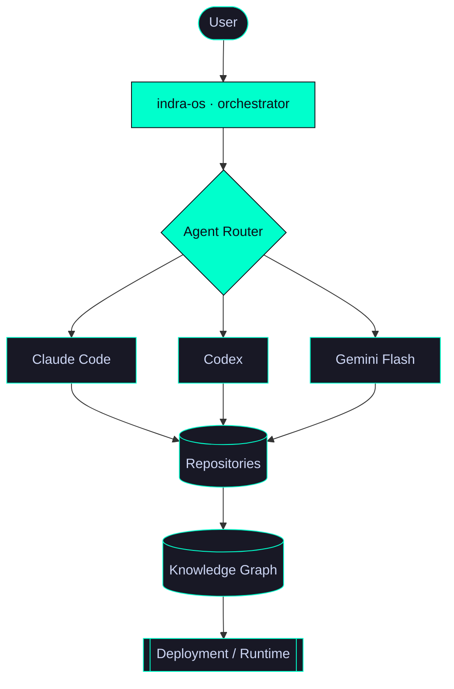

<!-- ╔══════════════════════════════════════════════════════════════════════════╗
     indra-os  ::  framebuffer  ::  github.com/gahlautabhinav
     Theme: Catppuccin Mocha / Neon Cyan  ::  bg #090d16  accent #00ffcc
     Rendered inside GitHub. Every panel maps to a real subsystem.
     ╚══════════════════════════════════════════════════════════════════════════╝ -->

<div align="center">


<a href="https://github.com/gahlautabhinav">

</a>


</div>

<!-- ══════════════════════════ WAYBAR (top bar) ══════════════════════════ -->

```text
 HOST indra-os │ USER abhinav │ WS 2:research  ─╴  CPU 34%  MEM 11.2/32G  GPU ▁▂▃▂  NET ↓1.2M ↑0.3M  ─╴  AGENTS ●●● 3  MODEL claude-opus-4  ─╴  VPN ✓  SEC ok  GIT main ✔  ─╴  BRIDGE Stellar↔EVM  GRAPH mounted  ─╴  ⏻ ONLINE   UP 6d 04:11   2026-07-11 14:22
```

<!-- ══════════════════════════ BOOT SEQUENCE ══════════════════════════ -->

## `⏻` boot — power-on self test

```text
indra-os UEFI firmware, rev 26.07 ──────────────────────────────────────────────
[    0.000000] POST .................................................... ok
[    0.041220] UEFI  handoff -> stub loader ............................ ok
[    0.128341] Loading kernel  (linux 6.11.0-indra) .................... ok
[    0.263004] systemd[1]: booting up ................................. ok
[    0.512883] Mounting Wayland compositor session .................... ok
[    0.774519] Starting Hyprland (tiling WM) .......................... ok
[    0.902240] Starting Waybar (status telemetry) ..................... ok
[    1.144902] Initializing AI agent scheduler ....................... [ ok ]
[    1.389117] Loading agent daemons: claude · codex · gemini ........ [ ok ]
[    1.640558] Mounting knowledge graph  (/mnt/graph) ................ [ ok ]
[    1.981774] Warming Vedic FSA compiler cache ...................... [ ok ]
[    2.204630] Synchronizing OSINT intel cache ....................... [ ok ]
[    2.560981] Bringing up cross-chain bridge  (Stellar ↔ EVM) ....... [ ok ]
[    2.883402] Starting market intelligence council .................. [ ok ]
[    3.010774] Reached target  Multi-Agent Runtime.
─────────────────────────────────────────────────────────────────────────────────
  Ready in 3.01s.  9 units active · 0 failed · 3 agents scheduled.
```

<!-- ══════════════════════════ FASTFETCH ══════════════════════════ -->

## `❯` fastfetch

```text
             ▟█▙                    abhinav@indra-os
           ▟█████▙                  ───────────────────────────────────────
         ▟███▛ ▜███▙                OS          indra-os (arch-based) x86_64
       ▟███▛     ▜███▙              Host        Detected · workstation
     ▟███▛  ╭─╮   ▜███▙            Kernel      6.11.0-indra
   ▟███▛    │◆│     ▜███▙          Uptime      6 days, 4 hours, 11 mins
   ▜███▙    ╰─╯     ▟███▛          Packages    1487 (pacman), 62 (flatpak)
     ▜███▙        ▟███▛            Shell       zsh 5.9 + powerlevel10k
       ▜███▙    ▟███▛              WM          Hyprland (Wayland)
         ▜███▙▟███▛                Bar         Waybar · eww widgets
           ▜████▛                  Terminal    foot / alacritty
             ▜█▛                   Editor      nvim 0.10 · VS Code
                                    Theme       Catppuccin-Mocha
   ● ● ● ● ● ● ● ●                  Icons       Papirus-Dark
   ● ● ● ● ● ● ● ●                  Font        JetBrainsMono Nerd Font
                                    Resolution  Detected @ 144Hz
   ───────────────────────────────────────────────────────────────────
   CPU  Detected · multi-core          Python   3.10.x      Docker  27.x
   GPU  Detected                        Node     20.x        Git     2.4x
   MEM  11.2 GiB / 32 GiB               Rust     1.83        Go      1.23
   ───────────────────────────────────────────────────────────────────
   Models   ◆ Claude Code   ◆ Codex   ◆ Gemini Flash   ○ local (planned)
```

<!-- ══════════════════════════ HOST CONFIG (about) ══════════════════════════ -->

## `❯` host configuration

```text
/etc/indra-os/host.conf ──────────────────────────────────────────────────────
  role          = builder / operator of autonomous engineering systems
  focus         = agent orchestration · applied NLP · OSINT · cross-chain
  primary_node  = indra-os  (mission control, schedules all agents)
  runtime       = Claude Code · Codex · Gemini  (multi-model, routed)
  domains       = Sanskrit computational linguistics · intel graphs · DeFi
  posture       = everything is a service; every service is observable
  github        = gahlautabhinav
```

<!-- ══════════════════════════ RUNNING SERVICES (systemctl) ══════════════════════════ -->

## `❯` running services — `systemctl status --all`

```text
UNIT                     LOAD    ACTIVE  SUB      DESCRIPTION
──────────────────────── ─────── ─────── ──────── ─────────────────────────────────
● orchestrator.service   loaded  active  running  indra-os · agent mission control
● vedicmind.service      loaded  active  running  Vedic meter compiler + RAG
● tray.service           loaded  active  running  gptray · desktop LLM tray daemon
● cron.service           loaded  active  running  github-ai-updates · repo poller
● intel.service          loaded  active  running  xint · OSINT identity graph
● telegram.service       loaded  active  running  telint · Telegram collection
● tripcode.service       loaded  active  running  yotsuba-intel · 4chan correlation
● bridge.service         loaded  active  running  cross-chain intent settlement
● market.service         loaded  active  running  stock-intelligence · NSE council
──────────────────────── ─────── ─────── ──────── ─────────────────────────────────
  9 loaded units · 9 active · 0 failed
```

<details>
<summary><code>❯ systemctl status orchestrator.service &nbsp;·&nbsp; indra-os</code></summary>

```text
● orchestrator.service - indra-os · agent mission control
     Loaded: loaded (/repos/indra-os; enabled; preset: enabled)
     Active: active (running)
   Main PID: 1  (indra-os)
      Tasks: 3 agents (claude, codex, gemini)
    Runtime: task routing · terminal orchestration · knowledge graph · automation
   Describe: Central nervous system. Schedules every other daemon, routes tasks to
             the right model, owns the developer workspace and terminal panes.
             All units below are children of this process.
       Repo: github.com/gahlautabhinav/indra-os
```
</details>

<details>
<summary><code>❯ systemctl status vedicmind.service &nbsp;·&nbsp; ved-project</code></summary>

```text
● vedicmind.service - Vedic meter compiler + RAG explanation engine
     Loaded: loaded (/repos/ved-project; enabled)
     Active: active (running)
      Stack: Next.js 14 · FastAPI · PostgreSQL + pgvector · Gemini Flash
     Engine: rule-based compiler · Finite State Automata · Pratishakhya grammar
    Dataset: 18,910 samples · 96.5% meter-detection accuracy

  pipeline:
     text ─▶ normalization ─▶ Pratishakhya rules ─▶ FSA compiler
          ─▶ meter detection ─▶ RAG retrieval ─▶ explanation ─▶ API

       Repo: github.com/gahlautabhinav/ved-project
```
</details>

<details>
<summary><code>❯ systemctl status intel.service &nbsp;·&nbsp; xint</code></summary>

```text
● intel.service - OSINT identity-mapping graph
     Loaded: loaded (/repos/xint; enabled)
     Active: active (running)
    Sources: X · Telegram · 4chan
    Runtime: graph traversal · identity correlation · link analysis · viz
   Describe: Ingests multi-platform signals, resolves entities across sources,
             renders the relationship graph. Feeds telegram.service + tripcode.service.
       Repo: github.com/gahlautabhinav/xint
```
</details>

<details>
<summary><code>❯ systemctl status bridge.service &nbsp;·&nbsp; Cross-Chain-Intent-Bridge-Protocol</code></summary>

```text
● bridge.service - cross-chain intent settlement
     Loaded: loaded (/repos/Cross-Chain-Intent-Bridge-Protocol; enabled)
     Active: active (running)
     Chains: Stellar ↔ EVM
    Runtime: intent engine · asset locking · cross-chain settlement · state sync
   Describe: Accepts a user intent, locks on source chain, settles on destination,
             keeps both sides state-synchronized.
       Repo: github.com/gahlautabhinav/Cross-Chain-Intent-Bridge-Protocol
```
</details>

<details>
<summary><code>❯ systemctl status market.service · tray.service · cron.service · telegram.service · tripcode.service</code></summary>

```text
● market.service   - stock-intelligence · Bayesian agent council over NSE,
                     premarket briefing, serverless Cloud Functions pipeline.
                     github.com/gahlautabhinav/stock-intelligence

● tray.service     - gptray · background daemon, desktop system-tray LLM
                     responses + notifications, native desktop integration.
                     github.com/gahlautabhinav/gptray

● cron.service     - github-ai-updates · scheduled GitHub polling, repo sync,
                     dependency monitoring, agent awareness of upstream changes.
                     github.com/gahlautabhinav/github-ai-updates

● telegram.service - telint · live channel collection, message parsing,
                     relationship extraction. Feeds intel.service graph.
                     github.com/gahlautabhinav/telint

● tripcode.service - yotsuba-intel · 4chan tripcode + anonymous identity
                     correlation, thread mapping. Feeds intel.service graph.
                     github.com/gahlautabhinav/yotsuba-intel
```
</details>

<!-- ══════════════════════════ PROCESS TREE ══════════════════════════ -->

## `❯` process tree — `pstree -p`

```text
systemd(1)
 └─ orchestrator.service ─ indra-os
     ├─ agent:claude ────── task routing · code · reasoning
     ├─ agent:codex ─────── implementation · diagnosis
     ├─ agent:gemini ────── flash inference · RAG
     ├─ vedicmind.service ─ FSA compiler ─▶ meter ─▶ RAG
     ├─ intel.service ───── xint ─┬─ telegram.service (telint)
     │                            └─ tripcode.service (yotsuba-intel)
     ├─ bridge.service ──── Stellar ↔ EVM settlement
     ├─ market.service ──── NSE Bayesian council
     ├─ tray.service ────── gptray desktop daemon
     └─ cron.service ────── github-ai-updates poller
```

<!-- ══════════════════════════ DIRECTORY TREE ══════════════════════════ -->

## `❯` filesystem — `tree ~/Projects`

```text
~/Projects
├── indra-os                            # orchestrator.service · mission control
├── ved-project                         # vedicmind.service · FSA meter compiler
├── xint                                # intel.service · OSINT graph
├── telint                              # telegram.service · channel collection
├── yotsuba-intel                       # tripcode.service · 4chan correlation
├── Cross-Chain-Intent-Bridge-Protocol-Protocol  # bridge.service · Stellar ↔ EVM
├── stock-intelligence                  # market.service · NSE council
├── gptray                              # tray.service · desktop LLM daemon
└── github-ai-updates                   # cron.service · repo sync
```

<!-- ══════════════════════════ OBSERVABILITY DASHBOARD ══════════════════════════ -->

## `❯` observability — `btop` / mission control

```text
┌─ SYSTEM ────────────────────────────────┐ ┌─ RUNTIME ─────────────────────────────┐
│ CPU  ███████████████░░░░░░░░░░░░  34%    │ │ Services running .............. 9      │
│ MEM  ████████████████░░░░░░░░░░░  41%    │ │ Agents scheduled .............. 3      │
│ GPU  ██████░░░░░░░░░░░░░░░░░░░░░░  18%    │ │ Repositories .................. 9      │
│ NET  ↓ 1.2 MB/s   ↑ 0.3 MB/s             │ │ Inference queue ............... 2      │
│ TEMP 52°C   FAN auto   PWR balanced      │ │ Knowledge nodes ............... loaded │
└──────────────────────────────────────────┘ └───────────────────────────────────────┘
┌─ ENGINES ───────────────────────────────┐ ┌─ INTEL ───────────────────────────────┐
│ Compiler accuracy ██████████████████ 96.5%│ │ Threat graph .............. OSINT-ALPHA│
│ Dataset samples ............. 18,910     │ │ Sources ............. X · TG · 4chan   │
│ Bridge latency ▁▂▃▂▁ nominal (Stellar↔EVM)│ │ Correlation state ......... active     │
│ Market council ............. NSE armed   │ │ Graph traversal ........... online     │
└──────────────────────────────────────────┘ └───────────────────────────────────────┘
```

<!-- ══════════════════════════ LOADED RUNTIME MODULES (skills) ══════════════════════════ -->

## `❯` loaded runtime modules — `lsmod`

```text
MODULE                 SIZE   USED BY
────────────────────── ────── ──────────────────────────────────────────────
orchestration          heavy  indra-os · multi-agent routing
nlp_sanskrit           heavy  vedicmind · FSA · Pratishakhya grammar
osint_graph            heavy  xint · telint · yotsuba-intel
web_fullstack          med    Next.js 14 · FastAPI · PostgreSQL/pgvector
cross_chain            med    Stellar · EVM · intent settlement
serverless             med    Cloud Functions · market pipeline
desktop_daemon         low    gptray · tray + notifications
```

<div align="center">


</div>

<!-- ══════════════════════════ TERMINAL PANES ══════════════════════════ -->

## `❯` tmux — active panes

<table>
<tr>
<td width="50%" valign="top">

```text
❯ journalctl -fu vedicmind.service
[14:20:57] normalize  input verse ....... ok
[14:20:57] pratishakhya  rules applied .. 42
[14:20:58] fsa compile  states=311 ...... ok
[14:20:58] meter detect  → Anushtubh .... 0.981
[14:20:58] rag retrieve  ctx k=6 ........ ok
[14:20:59] explain  emit → /api/verse ... 200
```

</td>
<td width="50%" valign="top">

```text
❯ watch bridge status
SRC   Stellar     locked  1 intent
DST   EVM         settling
STATE synchronizing ....... ▁▂▃▂▁
LAT   nominal
LAST  settled 00:41 ago      ✔
```

</td>
</tr>
<tr>
<td width="50%" valign="top">

```text
❯ htop
PID USER    S  CPU%  MEM%  COMMAND
  1 abhinav R   6.2   0.3  indra-os
 21 abhinav S   4.1   2.1  claude
 22 abhinav S   3.7   1.9  codex
 23 abhinav S   2.9   1.4  gemini
 41 abhinav S   1.2   3.6  vedicmind
```

</td>
<td width="50%" valign="top">

```text
❯ agent queue
POS  AGENT   TASK                 STATE
 1   claude  route incoming intel run
 2   codex   patch bridge sync    run
 3   gemini  rag explain verse    run
 -   local   (planned)            idle
```

</td>
</tr>
</table>

```text
❯ git log --oneline --graph --decorate
* a1f4c22 (HEAD -> main) indra-os: route intel tasks to gemini flash
* 7d90b1e ved-project: raise meter accuracy to 96.5% on 18,910 set
* 3c1aa87 bridge: harden Stellar ↔ EVM state sync on partial settle
* 55e02fd xint: merge telint + yotsuba-intel identity edges
* e9b7740 market: NSE premarket council → serverless Cloud Functions
```

<!-- ══════════════════════════ NETWORK ══════════════════════════ -->

## `❯` network — `traceroute` / `ss`

```text
❯ traceroute runtime
  1  internet ................................  8 ms
  2  github.com .............................. 14 ms
  3  github-actions .......................... 19 ms
  4  indra-os (orchestrator) ................. 21 ms
  5  agent-scheduler ......................... 22 ms
  6  knowledge-graph ......................... 24 ms
  7  runtime  [ REACHED ] .................... 25 ms

❯ ss -tunap  (established)
NETID  STATE   LOCAL            PEER               PROCESS
tcp    ESTAB   indra-os:agent   claude:api         orchestrator
tcp    ESTAB   indra-os:agent   codex:api          orchestrator
tcp    ESTAB   indra-os:agent   gemini:flash       vedicmind
tcp    ESTAB   bridge:intent    stellar↔evm        bridge
tcp    LISTEN  cron:poll        github:api         github-ai-updates
```

<!-- ══════════════════════════ ARCHITECTURE (one mermaid) ══════════════════════════ -->

## `❯` architecture



<!-- ══════════════════════════ LIVE SYSTEM TELEMETRY ══════════════════════════ -->

## `❯` live system telemetry

<div align="center">


<br/>

<!-- Snake requires the Platane/snk GitHub Action (see setup notes). -->
<picture>
  <source media="(prefers-color-scheme: dark)" srcset="https://raw.githubusercontent.com/gahlautabhinav/gahlautabhinav/output/github-contribution-grid-snake-dark.svg"/>
  <source media="(prefers-color-scheme: light)" srcset="https://raw.githubusercontent.com/gahlautabhinav/gahlautabhinav/output/github-contribution-grid-snake.svg"/>
  
</picture>

</div>

<!-- ══════════════════════════ SHUTDOWN ══════════════════════════ -->

```text
❯ uptime
 14:22:01 up 6 days,  4:11,  1 user,  load average: 0.34, 0.29, 0.31
❯ echo "connection held open — daemons still running."
```

<div align="center">


</div>
