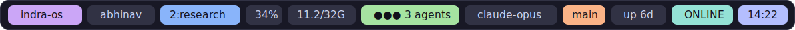

<!-- indra-os · github.com/gahlautabhinav · Catppuccin Mocha (mauve) rice
     Panels are generated SVG terminal windows (tools/gen.py -> assets/*.svg). -->

 

<!-- Catppuccin Mocha palette strip -->

  

<!-- Waybar -->

  

<!-- boot (animated) -->

  

<!-- fastfetch -->

  

<!-- systemctl services -->

  

<!-- git log pane -->

 

<!-- contribution telemetry (live) -->

  

